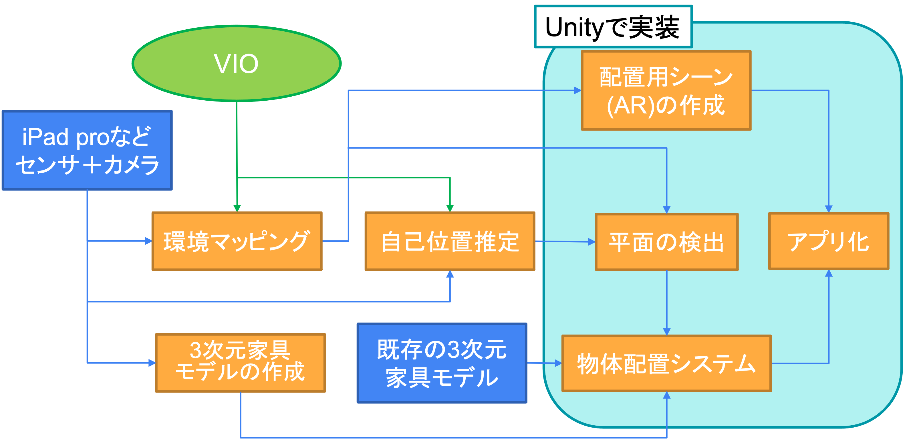

# ar-app

3 次元家具モデルを扱った AR アプリ

## 実装パイプライン



## 開発の役立つリンク・tips

[github でのチーム開発](https://qiita.com/siida36/items/880d92559af9bd245c34)<br>
[commit message の書き方](https://qiita.com/itosho/items/9565c6ad2ffc24c09364)<-これのライト版くらい書いてりゃ ok

## 開発ルール

### unity 上

- 自分の作った object 以外は触らない．(コードのアタッチも含め)
  - 自分用のシーンを作ると良いかも

### coding ルール

コードフォーマットは Omnisharp を使う.<br>
命名規則等はUnityのサンプルコードに倣って行う。

## 各種バージョン

| ライブラリ等 | バージョン   |
| ------------ | ------------ |
| unity        | 2021.3.11.f1 |

## サーバーの起動方法

実行環境：Python 3.11.0
```
cd /server_name # serverとしてバンドルを保存しているディレクトリ
python3 -m http.server 8000 --bind ip # ip：自分の使用している機材のipアドレス
```
問題点
- bundlewebloaderやassetbundleのビルドを機材ごとに変えないといけない (変更した状態でプッシュすると良くない)
  - そもそも、どれでもサーバーみたいな状況は考えられないので、シーンと同様変えないでもらうのが一番安全策だと思う
  - アセットも勝手にビルドできる状況になると非常に困りそうなので、これもシーンと同様1台でのみ行うのが得策(言ってることよくわからんかもやけど)


## TODO

- ~~[ ] all in one な Docker image の作成~~
  - [ ] python のバージョン
  - ~~[ ] ライブラリのバージョン(特に open3D,formatter は version で挙動が違う)~~
- [x] unity install (全員?)
